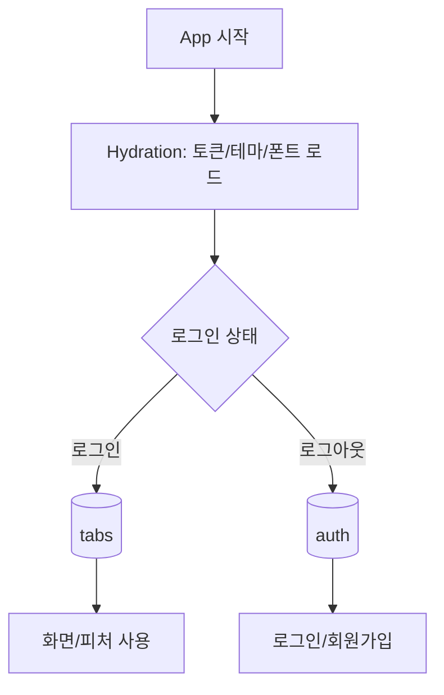
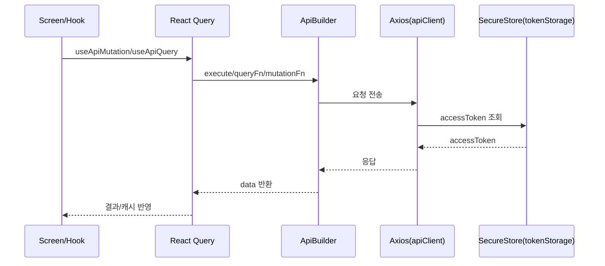

## Fridgely (FrontEnd)

냉장고 식재료를 **등록/관리**하고, **유통기한/알림** 등을 통해 버려지는 식재료를 줄이기 위한 모바일 앱입니다.

### 핵심 기능(요약)

- **냉장고/식품 관리**: 냉장고 추가/관리, 식품 등록·수정·상세
- **캘린더**: 날짜 기반으로 식품/일정 확인
- **알림**: 알림 권한 안내 및 설정 화면
- **인증**: 로그인/회원가입, (옵션) 아이디 저장

### 기술 스택(요약)

- **Expo + React Native**
- **expo-router**
- **Tamagui**
- **TanStack Query**
- **Zustand**
- **Axios**
- **Firebase Cloud Messaging(푸시)**

### 아키텍처(요약)

이 프로젝트는 **expo-router 기반의 화면 레이어(`app/`)** 와 **feature 기반 도메인 레이어(`src/features/`)**, 그리고 **공통 인프라 레이어(`src/shared/`)** 로 역할을 분리합니다.

```text
app/                → 라우팅/스크린(진입점, 탭/스택 구성)
src/features/*       → 도메인 단위(인증/홈/검색/캘린더/알림/프로필 등)
src/shared/*         → API/스토리지/Provider/디자인 시스템/유틸 등 공통
```

#### 라우팅 & 앱 진입 흐름

- `app/_layout.tsx`에서 앱 전역 Provider를 구성합니다(React Query, Tamagui Theme, 세션/온보딩/알림 게이트 등).
- 로그인 상태(`useAuthStore`)에 따라 `(auth)` 또는 `(tabs)` 스택을 분기합니다.



#### API 계층 (ApiBuilder + React Query)

- 공통 요청은 `src/shared/apis/apiClient.ts`(Axios 인스턴스)에서 처리합니다.
- `Authorization` 헤더 주입, `401` 시 **토큰 재발급** 및 재시도 로직이 포함됩니다.
- 도메인 API는 `ApiBuilder`로 선언하고, 화면/훅에서 `useApiQuery`/`useApiMutation`으로 호출합니다.



#### 인증/세션(토큰 저장) 설계

- 토큰은 `expo-secure-store` 기반 `tokenStorage`에 저장합니다.
- 전역 로그인 상태는 `Zustand(useAuthStore)`로 관리합니다.
- Axios 인터셉터에서 `401`을 감지하면 refresh token으로 재발급을 시도하고, 실패 시 토큰을 정리합니다.

### 로컬 실행

```bash
npm install
npm run start
```

플랫폼별 실행:

```bash
npm run android
npm run ios
```

### 빌드(EAS)

프로필은 `eas.json`의 `development/preview/production`을 사용합니다.

```bash
eas build --platform android --profile production
```

### 테스트

이 프로젝트는 **Jest + jest-expo** 기반으로 테스트를 구성했습니다.

- **Unit**: 유틸/스토리지/스토어 로직 테스트
- **API**: `axios-mock-adapter`로 API 레이어/인터셉터 로직 테스트
- **Hook**: `@testing-library/react-native`의 `renderHook` 패턴으로 데이터 훅 동작 테스트

실행:

```bash
npm test
```

빠르게 한 번만 실행(워치 없이):

```bash
npx jest
```

참고:

- **설정**: `jest.config.js`, `jest.setup.js`
- **모킹**: `expo-secure-store`, `tokenStorage` 등은 전역 모킹으로 테스트 격리
- **테스트 위치**: `src/**/__tests__/**`, `*.test.ts(x)`

### 폴더 구조(핵심)

```text
app/
  (auth)/            # 로그인/회원가입 라우트 그룹
  (tabs)/            # 탭 라우트 그룹
src/
  features/
    auth/            # api, hooks, screens, store, types
    notification/    # 알림 도메인(스토어 포함)
    ...              # home/search/calendar/food*/profile 등
  shared/
    apis/            # apiClient, ApiBuilder, fcm 등
    components/      # 공통 UI 컴포넌트
    hooks/           # 공통 훅(예: hydration)
    lib/             # storage/queryClient 등 인프라
    providers/       # 세션/온보딩 등 전역 게이트
    stores/          # theme/fridge 등 공통 store
    theme/           # tokens/themes
```

### 규칙(커밋 메시지)

형식:

```text
[#이슈번호] Prefix: 구현_내용
```

예시:

```text
[#1] Setting: 라우터 세팅
[#3] Feat: 로그인 기능 서버 연동
[#4] Fix: 로그인 연동 API Path 수정
```

Prefix 목록:

| 커밋 타입   | 내용                                       |
| ----------- | ------------------------------------------ |
| ✨ Feat     | Feat: 기능 구현                            |
| 🐛 Fix      | Fix: 버그 수정                             |
| ✏️ Rename   | Rename: Home → HomePage 컴포넌트 이름 변경 |
| 🔥 Remove   | Remove: 불필요한 이미지 리소스 제거        |
| 💄 Style    | Style: 코드 포매팅 및 세미콜론 추가        |
| 📱 Design   | Design: 메인 페이지 UI 수정                |
| ♻️ Refactor | Refactor: 로그인 로직 리팩토링             |
| ✅ Test     | Test: 유닛 테스트 코드 추가                |
| 📝 Docs     | Docs: README 커밋 메시지 규칙 추가         |
| 🔧 Chore    | Chore: .gitignore 파일 수정                |
| ⚡️ Perf    | Perf: 이미지 로딩 성능 개선                |
| ⚙️ Setting  | 빌드 및 패키지 등 프로젝트 설정            |
