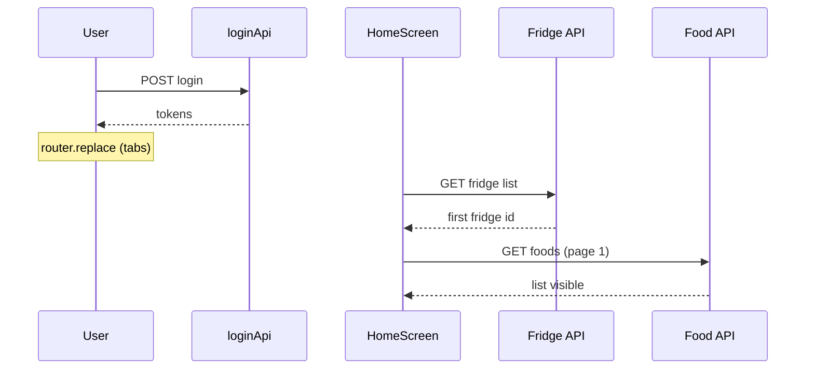

# Performance

Fridgely 모바일 앱의 **성능 측정 방법**, **결과**, **해석**을 정리한 문서입니다.  
동일 기기·동일 시나리오로 측정한 뒤, 변경 시 Before/After를 기록합니다.

---

## 0. Results at a glance

**Device**: Samsung Galaxy S21 5G · **Android 15** · 120Hz adaptive

| ID | Scenario | Result | Build |
|----|----------|--------|-------|
| S1 | Home list scroll | FPS **60~120**, no jank | Expo dev |
| S2 | Cold start → interactive | **~2.36s** avg (2.41 / 2.33 / 2.35) | EAS internal |
| S3 | Login → Home (content visible) | **~1.19s** avg (1.40 / 1.21 / 0.95) | EAS internal |
| S4 | Search list scroll | *(optional, same method as S1)* | — |
| S5 | Android `expo export` | **~23 MB** (JS **~10.6 MB** + assets **~13 MB**) | Local export |

**Summary**: Galaxy S21 5G (Android 15) — cold start **~2.4s**, login→home **~1.2s**, home scroll **60fps+**, export bundle **~23MB** (fonts/assets-heavy).

---

## 1. 측정 원칙

| 원칙 | 설명 |
|------|------|
| **릴리즈 우선** | 최종 수치는 EAS `production` / Release 빌드 기준이 이상적 |
| **1차 스크리닝** | 개발 빌드(`npx expo start`) + Perf Monitor로 병목 후보 탐색 |
| **시나리오 고정** | 같은 화면·같은 데이터 양·같은 기기에서 3회 측정 후 평균 |
| **체감 병행** | FPS만으로 판단하지 않고, 끊김(jank) 여부를 함께 기록 |

---

## 2. Environment

현재까지 측정에 사용한 기기입니다. 추가 측정 시에도 **동일 기기**를 권장합니다.

```text
Device: Samsung Galaxy S21 5G (SM-G991N / regional variant may differ)
OS: Android 15
Display: 120Hz adaptive (설정에 따라 60~120Hz, Perf Monitor에서 60 초과 FPS 가능)
Build (S1): Expo development — npx expo start
Build (S2): EAS internal test build (비공개 테스트)
App version: (측정 시점 빌드 번호 기록 권장)
```

측정할 때마다 **Date**만 추가로 적습니다.

---

## 3. 도구

### React Native Performance Monitor

- **설치 불필요** — 개발 빌드에서 디바이스 흔들기 → Developer Menu → **Show Perf Monitor**
- **UI FPS**: 네이티브 UI 렌더링
- **JS FPS**: JavaScript 스레드(리렌더, 필터/정렬, React Query 등)

**해석 가이드**

| 구간 | FPS (대략) | 체감 |
|------|------------|------|
| 좋음 | 58~60+ 유지 | 부드러움 |
| 무난 | 50~57 | 가끔 끊김 |
| 개선 필요 | 40 미만이 길게 지속 | 스크롤·전환 시 버벅임 |

> **120Hz / 90Hz 디스플레이**에서는 Perf Monitor가 **60을 초과**한 값(예: 80~120)을 표시할 수 있습니다.  
> 이는 “버그”가 아니라 고주사율 환경에서의 관측 특성으로, **「60fps 이상 유지」**로 기록하는 것을 권장합니다.

### 기타 (선택)

| 도구 | 용도 |
|------|------|
| React DevTools Profiler | 불필요한 리렌더 탐지 |
| React Query DevTools | 중복 fetch, 캐시 동작 |
| Android `adb shell am start -W` | Cold start (Android) |
| Xcode Instruments → App Launch | Cold start (iOS) |
| `npx expo export` | 번들/에셋 크기 |

---

## 4. 시나리오

### S1. Home list scroll (홈 식품 리스트 스크롤)

1. 로그인 후 홈 진입
2. 식품이 표시된 상태에서 리스트를 **약 10초** 연속 스크롤
3. Perf Monitor로 UI·JS FPS 관찰
4. 체감 끊김 여부 메모

**관련 코드**

- `src/features/home/screens/HomeScreen.tsx` — `FlashList`, 필터/정렬 `useMemo`
- `SwipeableFoodListItem` — 스와이프 + 리스트 아이템

### S2. Cold start (앱 cold start)

1. 앱 완전 종료(백그라운드 제거)
2. 아이콘 탭 → 스플래시 종료 후 **첫 인터랙션 가능**까지 시간 측정 (스톱워치 3회 평균)

**관련 코드**

- `app/_layout.tsx` — Provider, 스플래시 오버레이
- `src/shared/hooks/useAppHydration.ts` — auth/theme hydrate

### S3. Login → Home (로그인 후 홈 진입)

1. 로그아웃 상태에서 로그인
2. 로그인 버튼 탭 → 홈 리스트·스켈레톤 종료까지 시간 / API 횟수

**관련 코드**

- `src/features/auth/hooks/useAuthMutation.ts`
- 홈 마운트 시 `useFridgeQuery`, `useAllFoodStatusQuery` / `useFridgeFoodStatusQuery`

### S4. Search list scroll (검색 결과 스크롤)

- `src/features/search/screens/SearchScreen.tsx` — `FlashList`

### S5. Bundle / export size (JS 번들·에셋)

로컬에서 Metro export 산출물 크기를 확인합니다. **APK/AAB 설치 파일 크기와는 다릅니다**(네이티브 바이너리·Hermes 엔진 등이 별도로 포함됨).

```bash
npx expo export --platform android
du -sh dist dist/_expo dist/assets
```

---

## 5. Results

### S1. Home list scroll — 측정됨 (1차)

| 항목 | 값 |
|------|-----|
| **Device** | Samsung Galaxy S21 5G |
| **Build** | Expo development (`npx expo start`) |
| **Tool** | React Native Performance Monitor |
| **Observation** | 스크롤 중 UI·JS FPS **대략 60~120** 구간, **체감 끊김 없음** |
| **Conclusion** | 리스트 스크롤 성능 **양호**. 120Hz 등 고주사율 기기에서는 60 초과 표시 가능 |

### S2. Cold start → interactive — 측정됨

| 항목 | 값 |
|------|-----|
| **Device** | Samsung Galaxy S21 5G |
| **Build** | EAS 빌드 (비공개 테스트 / internal distribution) |
| **Method** | 앱 완전 종료 후 실행 → 스플래시 종료·첫 인터랙션 가능까지 (스톱워치) |
| **Runs** | 2.41s, 2.33s, 2.35s |
| **Average** | **~2.36s** |
| **Conclusion** | Expo + hydration(인증·테마)·커스텀 스플래시·폰트 로드가 포함된 cold start 기준 **실사용 가능 수준**. 추가 개선 시 `useAppHydration` 병렬화·스플래시 조건 검토 |

### S3. Login → Home — 측정됨

| 항목 | 값 |
|------|-----|
| **Device** | Samsung Galaxy S21 5G, Android 15 |
| **Build** | EAS internal test build (비공개 테스트) |
| **Method** | 로그인 버튼 탭 → 홈 식품 리스트(또는 빈 목록) 표시·스켈레톤 종료까지 (스톱워치) |
| **Runs** | 1.40s, 1.21s, 0.95s |
| **Average** | **~1.19s** |
| **Note** | 네트워크·캐시에 따라 편차 가능(0.95~1.40s). 홈 API 흐름은 [§6.1](#61-홈-마운트-api) 참고 |

### S4. Search list scroll — 선택 (미측정)

검색 탭은 `FlashList` + 클라이언트 필터(`useSearchFood`)입니다. 홈과 동일하게 Perf Monitor로 10초 스크롤 측정 후 이 표를 채웁니다.

| Scenario | Result | Note |
|----------|--------|------|
| Search scroll | — | S1과 동일 방법 |

### S5. Bundle / export size — 측정됨

| 항목 | 값 |
|------|-----|
| **Command** | `npx expo export --platform android` |
| **`dist/` total** | **~23 MB** |
| **JS (Hermes `.hbc`)** | **~10.6 MB** (`_expo/static/js/android/entry-….hbc`) |
| **Bundled assets** | **~13 MB** (`dist/assets/`) |
| **Note** | EAS 스토어용 **APK/AAB**는 네이티브 모듈(Firebase 등) 포함으로 이보다 큼. export는 JS·번들 에셋 기준 |

**에셋 비중이 큰 항목 (개선 후보)**

| Asset | Size (approx.) |
|-------|----------------|
| `GyeonggiBatang-Bold.otf` | ~3.7 MB |
| `GyeonggiTitle-Bold.otf` | ~1.1 MB |
| `BMJUA.otf` | ~1.3 MB |
| `profile_*.png` (4 files) | ~0.9–1.2 MB each |
| `splash-screen.png` | ~1.1 MB |

---

## 6. API & loading analysis (코드 기준)

### 6.1. 홈 마운트 API

`HomeScreen` 마운트 시 React Query 훅 구성입니다. **실제 HTTP는 `enabled` 조건을 만족할 때만** 발생합니다.

| 순서 | Hook | API (개념) | `enabled` 조건 |
|------|------|------------|----------------|
| 1 | `useFridgeQuery` | 냉장고 목록 | 로그인 상태 |
| 2a | `useAllFoodStatusQuery` | 전체 탭 식품 상태 | 로그인 + **전체 탭** (`isAllFridgeTab`) |
| 2b | `useFridgeFoodStatusQuery` | 냉장고별 식품(커서 페이지) | 로그인 + **냉장고 ID 선택됨** + 단일 탭 |

**기본 탭(단일 냉장고) 첫 진입 시 흐름**

1. 냉장고 목록 **1회** fetch  
2. `useEffect`로 첫 냉장고 ID 설정  
3. 해당 냉장고 식품 **1회** fetch (무한 스크롤 1페이지)

→ 홈 콘텐츠까지 **HTTP 최소 2회**(목록 + 식품), **순차(waterfall)** 에 가깝습니다.  
`useFridgeQuery`와 식품 query는 ID 확정 전에는 동시에 안 나갑니다.

**전체 탭**이면 2a만 켜지고 2b는 꺼집니다(동시에 둘 다 fetch하지 않음).

---

### 6.2. Login → Home API

로그인 버튼 이후 대략적인 네트워크 경로입니다.



| 단계 | 요청 | 비고 |
|------|------|------|
| 로그인 | `loginApi` 1회 | `useLoginMutation` |
| (로컬) | SecureStore 토큰 저장 | 네트워크 아님 |
| 홈 | 냉장고 목록 + 식품 | §6.1 — **최소 2 HTTP** |
| (백그라운드) | FCM 토큰 등록 | `SessionProvider` / `useFcmSync` — 홈 표시와 병렬 가능 |

스톱워치 **~1.19s**에는 위 로그인 + 홈 2단계 fetch + UI 전환이 포함됩니다.

---

### 6.3. Cold start 구간

`app/_layout.tsx` + `useAppHydration` 기준으로 cold start에 포함되는 작업입니다.

| 구간 | 작업 |
|------|------|
| 네이티브 부팅 | Expo / RN 런타임 |
| JS | Provider 트리, Firebase background handler 등록 |
| Hydration | `useAuthStore.hydrate` (SecureStore), `useThemeStore` rehydrate |
| UI | 커스텀 폰트 3종 로드, `FridgeSplashScreen` 애니메이션 |
| 분기 | `isLoggedIn` → `(tabs)` / `(auth)` 스택 |

**~2.36s**는 위 전체를 포함한 **사용자 체감 시작 시간**입니다.

---

### 6.4. 검색 탭

- `useSearchFood` → `useFoodStatusQuery(fridgeId)` 로 **홈과 동일 계열 API** 재사용
- 검색어 필터는 **클라이언트 `useMemo`** (추가 HTTP 없음)
- 홈에서 이미 fetch된 데이터가 캐시에 있으면 검색 탭 진입이 빨라질 수 있음 (React Query `staleTime` 기본값에 따름)

---

## 7. Quality & regression (테스트)

성능 수치와 별도로, API·인증 등 **회귀 방지**용 테스트를 유지합니다.

| 영역 | 예시 |
|------|------|
| API 인프라 | `apiClient.test.ts` (401 재발급), `ApiBuilder.test.ts` |
| 인증 | `useAuthStore.test.ts` |
| 도메인 | home / food / fridge / notification / profile hooks·apis |

```bash
npm test
# 약 50개 test 파일, 180+ tests (로컬 기준)
```

---

## 8. 코드 레벨 체크리스트 (개선 후보)

측정만으로 충분할 때는 수정하지 않아도 됩니다. 이슈가 보이면 아래를 참고합니다.

| 영역 | 파일/내용 | 메모 |
|------|-----------|------|
| 리스트 | `HomeScreen` `FlashList` | `estimatedItemSize` 등 FlashList 권장 옵션 검토 |
| 리스트 | `SearchScreen` `renderItem` | 인라인 함수 → `useCallback` / memo |
| 시작 | `useAppHydration` | auth·theme hydrate 순서/병렬화 |
| API | 홈 마운트 queries | 중복 fetch, `staleTime` 조정 |
| 이미지 | `FoodListItem` | `expo-image` 캐시·리사이즈 |
| 에셋 | 폰트 3종 (~6 MB) | 서브셋·시스템 폰트 대체 검토 |
| 에셋 | `profile_*.png`, splash | WebP·리사이즈로 export 용량 절감 가능 |

---

## 9. Before / After 기록 템플릿

성능 개선 시 아래 형식으로 기록합니다.

```markdown
### [날짜] [변경 요약]

**Environment**: Device / Build / ...

| Scenario | Before | After | Change |
|----------|--------|-------|--------|
| Home scroll FPS | | | |
| Cold start | | | |

**Cause**: (예: 리스트 renderItem 불안정)
**Fix**: (예: memo + estimatedItemSize)
```

---

## 10. Limitations

- **개발 빌드**는 HMR·로그·디버그 오버헤드로 **릴리즈보다 FPS가 낮거나 불안정**할 수 있음.
- Perf Monitor 수치는 **절대 벤치마크**보다 **동일 환경 Before/After 비교**에 적합함.
- **120Hz** 기기에서 60 초과 FPS는 정상 관측 범위일 수 있음 — 과장 표현(「120 FPS 달성」)은 피하고 **「60fps+ 유지」** 권장.

---

## 11. 재현 방법 (Quick)

```bash
npm install
npx expo start
```

1. 실기기에서 앱 실행
2. 흔들기 → **Show Perf Monitor**
3. 홈 → 리스트 10초 스크롤 → FPS·체감 기록

릴리즈 빌드:

```bash
eas build --platform android --profile production
# 설치 후 동일 시나리오 반복
```
